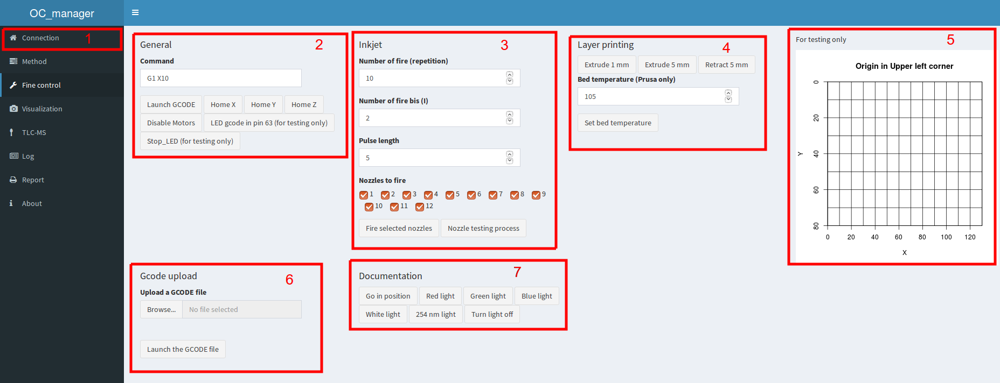

For preview, a version of OC_manager without device connected can be accessed online: [134.176.7.66/OC_manager](134.176.7.66/OC_manager).

## Prerequisite

* The device had been installed properly ([github repository](https://github.com/DimitriF/OCLab)).
* OC manager had been installed on a linux system ([github repository](https://github.com/DimitriF/OC_manager)).
* OC manager is hosted on a raspberry pi with static IP and that OC manager is launch at reboot via crontab or equivalent method.
* OC_manager can be accessed on a modern web browser via the static IP on port 80.

## Turning ON the device

{width=50%}

Those connections can be made with any order but this one is preferable.

1. If the raspberry pi is accessed via the local network, connect the ethernet cable to the raspberry pi.
2. Connect the 5V 2A power supply to the raspberry pi.
3. Check that the USB cable is connected between the RAMPS and the raspberry pi.
4. Connect the 12V power supply to the RAMPS.
5. From a web browser, go to the static IP of the rapsberry pi to access OC manager.

\pagebreak

## Tabs presentation

### Connection

The device does not connect automatically.

1. Location of the tab
2. Login if enable in the __config.R__ file, this function is very basic and not encrypted but at least it is not in a text document. When logged in with the __admin__ user, you can add and delete user and modify their password.
3. Plate info, give it a specific name and this name will appear in the log as well as in the pictures folder files.
4. Connect to the board, choose the good port, refresh if needed and connect the board. When the button change to __disconnect the board__, you are connected, it is always good to test it in __fine control__. If there is connection problem, reboots fix it most of the time.
5. Reboot and shutdown, if the directory of OC_manager is __/home/pi/OC_manager/__ you can reboot and shutdown the system from here, usefull for headless system.

\pagebreak

### Method

The core of  OC_manager, this is where GCODE sequences are created, updated and sent to the machines.

1. Location of the tab
2. List of available steps. Select one and use the "+" button (4) to add it to the list of selected step (3) 
3. List of selected step. Select one to update (5) and launch with the "play" button (4)
4. Action buttons. Add a step, delete a step, run a step, save, load etc... Note that help appear when each button it hovered, USE IT.
5. Specific button for the current step. Update the step and download the GCODE. When a step is added, no GCODE is associated with it, the step must be updated to do so, then GCODE (10), text feedback (8) and plotting feedback (9) will appear.
6. Step table. This is where you can modify the parameters, no details here, use the feedbacks for this (8-9).
7. Complementary step table: For some step, a complementary table is necessary. Generally, the number of row in this table is set in the main table, it may be necessary to first update after the main table is set, then update again with this complementary table set.
8. Text feedback after update
9. Plot feedback after update. This is may be the most important as it gives an idea of what the device will do.
10. GCODE table. Not available in classic machines of analytical chemistry, this table is here to give more details to the user.
11. Saving and loading method name. By using the "load" and "save" buttons (4), it is possible to access the method in an other session.
12. Text feedback. Another feedback which changes at each user action.

\pagebreak

### Fine control

As this device is a prototype, it is often necessary to control it more in detail.

1. Location of the tab
2. General section, should apply to all device, you can launch a specific GCODE or home specifically an axis and release the motors. Look at the GCODE page of the reprap website to learn your gcode.
3. Inkjet section made specifically to fire drop with the inkjet, you can fire on selective nozzles, fire different amount of drop with different pulse width. The best here is to use the __nozzle testing process__ which will fire each nozzles one after another in different position allowing to know which one are working.
4. Layer printing section, deprecated.
5. Position section, can be use but not very usefull anymore.
6. Use this section to launch an hand made or modified GCODE.
7. Visualization section to turn on and off specific LEDs.

\pagebreak

### Visualization

This tab allows to access the pictures chromatograms that were captured. Those files are also available in the pictures folder in the OC_manager folder.

1. Location of the tab
2. Update the folder to access teh latest data
3. Select a subfolder, note that the name of the plate set in the connection tab is present here.
4. Select one of the image in this folder, the choice is between light, ISO and exposure time.
5. Observe the picture

\pagebreak

### Log

In OC_mannager, all action are logged in a csv file which can be observed in this tab.

