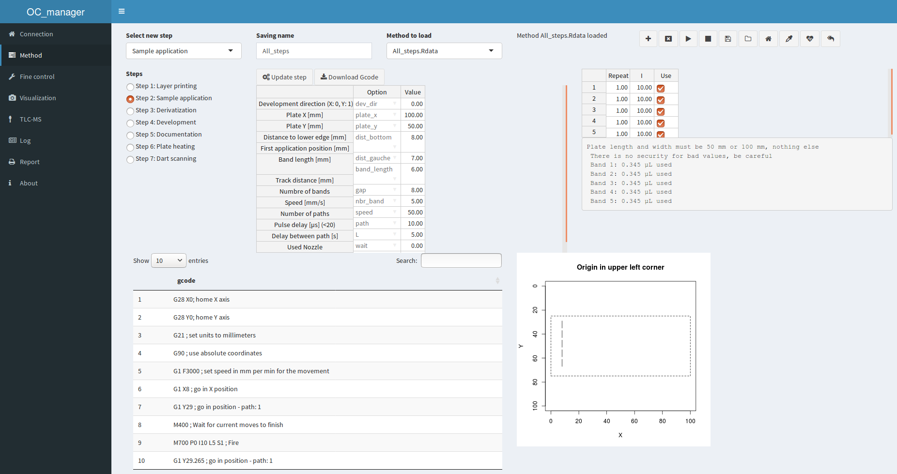

OC_manager
===========

Shiny app to operate apparatus of office chromatography.



## Raspberry pi image

Follow [this link](https://jlubox.uni-giessen.de/dl/fi5d7vosAXVt6w1cAmn4RBZ2/OC_manager_DF.gz) to download an image of Raspbian lite with the OC_manager set-up, last updated: 2020-10-12.

If you prefer to use Raspberry Pi OS with desktop, follow [this link]() to download a respective OC-manager image, last updated: 2020-10-12. User is pi and password raspberry. Using the configuration tool, select your country, language and keyboard.

You also can later upgrade the lite version with a desktop, file manager and browser by running the following command:

```
sudo apt-get install -y raspberrypi-ui-mods rpi-chromium-mods
```

You will need to setup the static IP to use OC_manager the way it was intented to be used (without screen). [This link](https://raspberrypi.stackexchange.com/questions/37920/how-do-i-set-up-networking-wifi-static-ip-address) should help (use dhcpcd.conf!).

Then you can access OC_manager from your web browser on the static IP you set as the software is served with a cronjob on port 80.

## Manual Installation

This procedure was tested on rasbian lite and desktop, downloaded 05-04-2018.

## First opening

Log in as user pi with password raspberry. Change the password with the configuration settings.

```
sudo raspi-config
```

expand file system
enable camera, ssh, vnc, gpio, i2c
set wifi passwd or static IP

followed by

```
sudo apt-get update
sudo apt-get upgrade
sudo reboot
```

## Clone this github repository

```
git clone https://github.com/OfficeChromatography/OC_manager.git
```

## Installation script

In the downloaded folder home/pi/OC_manager, you will find an installation script to be executed (last updated and tested 2020-10-12). The following command will execute the installation and reboot the system.

```
sudo bash OC_manager/oc-manager-install.sh |& tee oc-install.txt
```
In case of installation problems, the log file oc-install.txt can be checked for error messages concerning, for example, missing dependencies.

## Run

### Started at reboot with crontab (the best)

Crontab is a job scheduler for UNIX-like system. The file can be accessed with the following commands and the lines inside will be executed at the appropriate moment.

```
sudo crontab -e
```

Once in the editor, add this line which will launch the application at reboot, if the static IP had been set, the application will be available at the IP of the raspberry pi:

```
@reboot Rscript /home/pi/OC_manager/app_exec.R
```

### Directly from R (in case of problem to catch the errors)

From the folder (use `setwd()`) 

```r
shiny::runApp()
```

### Using Raspbian desktop

Having installed Raspberry Pi OS with desktop and connected a monitor, keyboard and mouse to the RPi, run the OC_manager directly from R, whereafter the Raspbian browser is opened, listening to the shiny app.

## Documentation

A pdf is available in the folder ```Instruction```.

For implementing a new method, a pdf is also available in the same folder.

